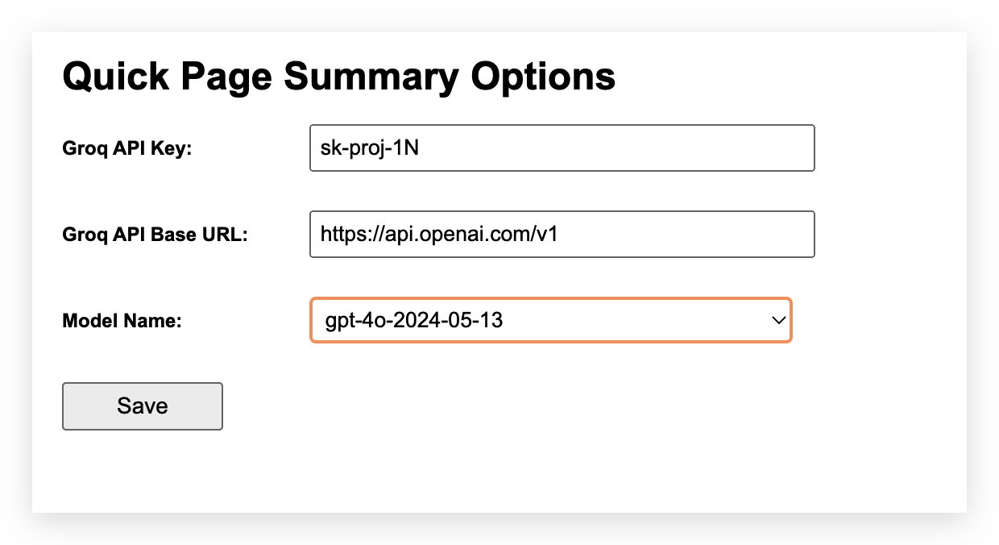

# 小濃縮 (Quick Summary)

小濃縮是一款 Chrome 擴展程序，使用 groq API 來快速總結網頁內容。該擴展程序旨在幫助用戶更高效地瀏覽和處理信息，提供簡潔、準確的內容摘要。

[](https://www.youtube.com/watch?v=3HLD1YjOtGk)

## 功能

- **網頁內容總結**：通過 groq API 自動生成網頁內容的摘要。
- **多語言支持**：支持繁體中文和英文兩種語言。
- **API 設置選項**：允許用戶在擴展設置中配置 API 密鑰和 Base URL。

## 安裝

1. 克隆此存儲庫到本地：
    ```bash
    git clone https://github.com/tbdavid2019/chrome-quick-summary.git
    ```

2. 打開 Chrome 瀏覽器，進入 `chrome://extensions/`。

3. 打開「開發者模式」。

4. 點擊「加載已解壓的擴展程序」，選擇你剛剛克隆的 `chrome-quick-summary` 文件夾。

## 使用方法

1. 安裝完成後，點擊 Chrome 工具欄上的擴展圖標。
2. 在彈出的窗口中，點擊「總結」按鈕來生成當前頁面的摘要。
3. 你可以在擴展的設置頁面中設置你的 groq API 密鑰和 Base URL。

## 設置選項

- **API 密鑰**：在設置頁面輸入你的 groq / openai / azure ai 等 API 密鑰，以便訪問 API。
- **API Base URL**：可選，設置 API 的 Base URL，默認為 `https://api.groq.com/`。
- **模型選擇** (選擇模型): 選擇你想使用的模型（只要密鑰和BASE ULR正確設置，系統會載入可用的模型 ）



## 貢獻

我們歡迎社區的貢獻！如果你有任何改進建議或發現了 bug，請提交 issue 或 pull request。

1. Fork 這個存儲庫。
2. 創建你的功能分支 (`git checkout -b feature/your-feature`)。
3. 提交你的改動 (`git commit -am 'Add some feature'`)。
4. 推送到分支 (`git push origin feature/your-feature`)。
5. 創建一個新的 Pull Request。

## 隱私權政策
我們的擴展程序不收集任何個人數據。詳細隱私政策請參考 [隱私權政策](https://blog.david888.com/2024/09/chrome-extension.html)。

